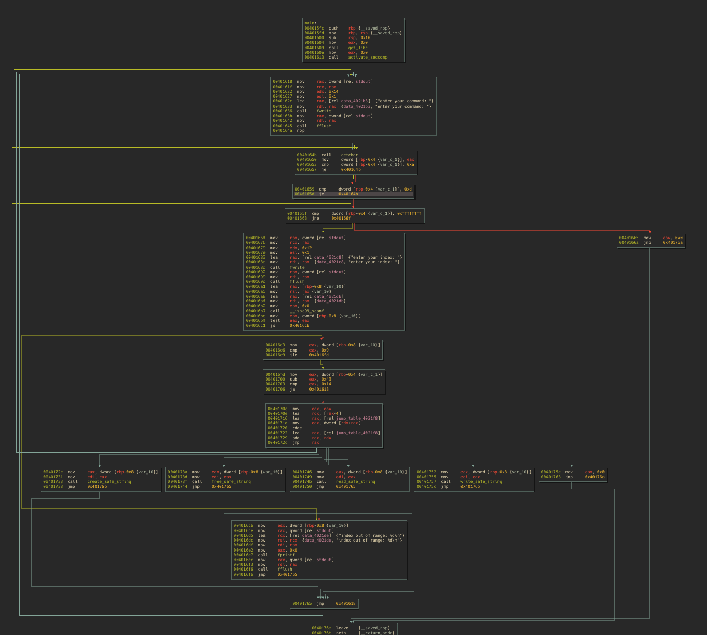
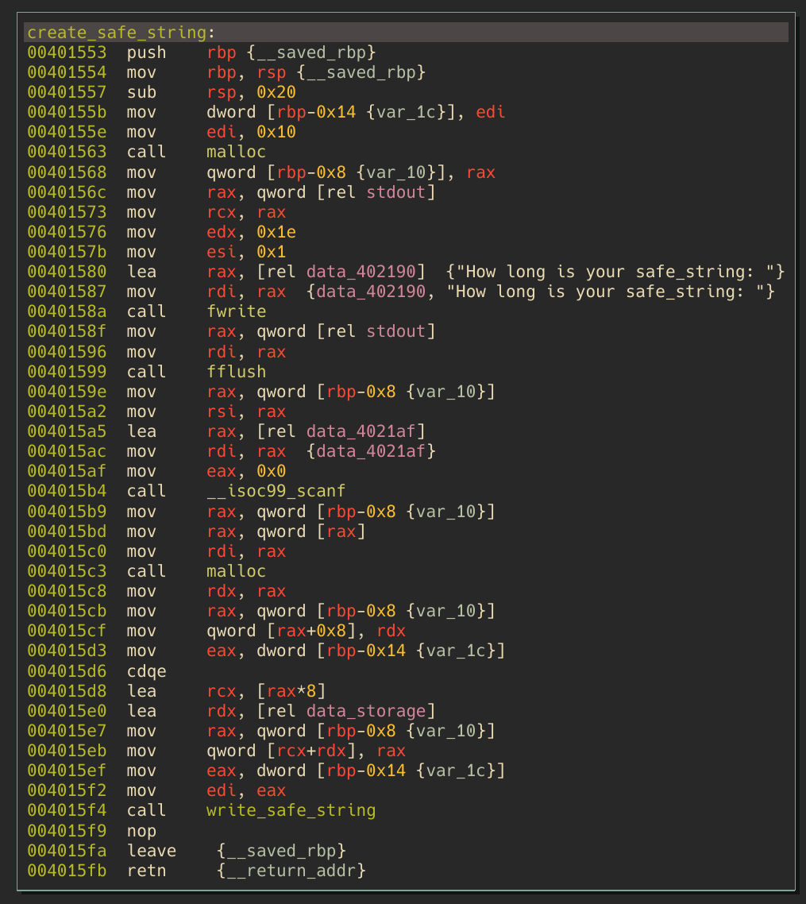
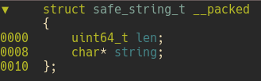
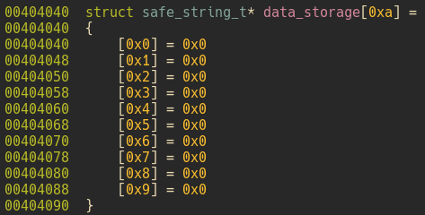
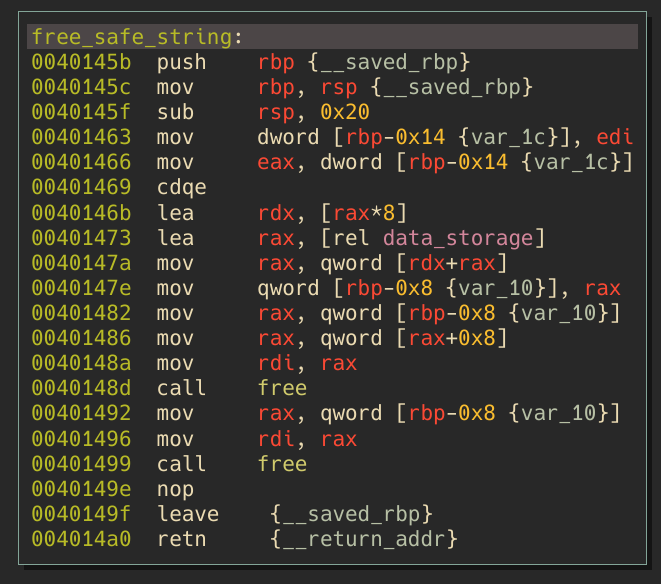
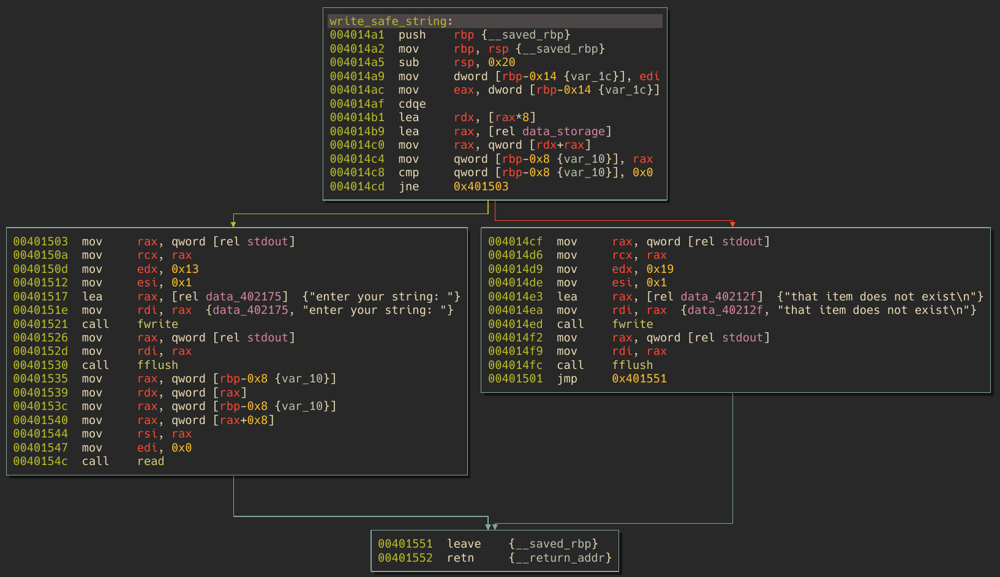

## BabyRop - DiceCTF 22

---
### Intro 
---
This was a nice little pwn challenge in an otherwise very challening CTF.
The site gives us 5 files and the message:
```
this ROP tastes kinda funny...
```
Not a super helpful hint, lets take a look at the files
1. babyrop - the actual binary
2. ld-linux-x86-64.so.2 - loader binary
3. libc.so.6 - libc version on the challenge server
4. seccomp-bpf.h - header file describing allowed behaviour
5. uaf.c - the C source of the challenge

Awesome, they were nice enough to provide us the source code for this. In the interest of education, I will walk through the (well, my) process of reverse engineering of the binary fist, and use the source as more of a side-by-side afterwards.

---
### Reverse Engineering
---
My weapons of choice for Linux RE are Binary Ninja and GDB with the [gef](https://gef.readthedocs.io/en/master/) extension. Most of this could be done in straight gdb, but that's like trying to drive accross the country in a Model T.


The first thing we're going to look at is the `main` function. The actual contents aren't super important on this image, so dont bother zooming in:


The main takeaway from this is the overall structure (which we can see simply by following the arrows). We can draw the following word diagram based on the image:

* Function Prologue
* Big Loop
  * Command prompt and get input
  * Compare to exit condition, continue if not met
  * Another prompt for input (index) with some other exit conditions
  * A switch statement (seen here as a jump table) with some functions:
    * `create_safe_string`
    * `free_safe_string`
    * `read_safe_string`
    * `write_safe_string`
  * Repeat

From this first pass, we can form some initial thoughts:
1. This is a fairly typical "Notes" style CTF challenge, so probably heap based
    * Duh, they give us a  file named `UAF.c`, but still, pattern recognition is at least 25% of CTFing
2. Since we have built in `read` and `write` functionality, we most likely already have 90% of the solution for the arbitrary R/W primitives we need.

___
Let's take a little bit deeper dive into the binary to see if we can scope our efforts a bit better.

Let's take a look at the `create_safe_string` function:



We can see this function do a few things (variables are autonamed still, didn't bother to rename):
0. Save the argument in `var_1c` (we can see this is the specified `index` from how it is called in main)
1. Allocate 0x10 (16) bytes on the heap with `malloc` and save that pointer in `var_10`
2. Prompts us to enter the length of our string
3. Read in our input and save it at the address in `var_10` (with a `%zu`, read a `size_t`, 8 byte number)
4. Allocate `var_10` bytes on the heap
5. Do some shuffling of the pointers to the allocated memory, and store them at some offset in `data_storage`
6. Call `write_safe_string` with the argument of `var_1c` (our original `index` value)

Let's break down Step 5 a little further, since there's kind of a lot going on here. Fundamentally, everything inside of the computer memory is either:
1. Data
2. Data which acts as a reference to other data (Pointers)

If you are a C programmer, you are probably already familiar with pointers. But since some poeple may not be as familiar, let's do a quick example:

(this is psuedo-C, but you get the point)
```
// char's occupy 1 byte in memory
char array[5] = {a, b, c, d, e};

char c1 = array[2];
char c2 = array + 2;
```
Essentially, all the `array[X]` formatting of array indexing is doing can be boiled down to:
```
(address of first array element) + ((size of data type) * (desired index into array))
```
Referencing items in a struct is essentially the same: the compiler knows that the desired item is just N bytes into the blob of data that represents the struct in memory.

Knowing this, we can construct the following pseudo-C from the two allocations and storage:
```
item1 = malloc(0x10)
scanf("%zu", item1) // size_t is 8 bytes, the first 8 bytes of item1 will be our number
item2 = malloc(item1) // malloc expects a size_t, so it will only read the first 8 bytes
item1 + 8 = item2 // store the pointer to item 2 8 bytes from the start of item1
data_storage[index] = item1
```
You may have recognize this as what it is: a struct comprised of 2x 8 byte variables - a number N, and a pointer to a buffer of size N.

Rewriting this into something closer to real C:
```
item1 = malloc(16)
scanf("%zu", &item1->number)
item1->buffer = malloc(item1->number)
data_storage[index] = item1
```

Based on this knowledge, I chose to define some custom structs in binja:

 


The `write_safe_string` is super boring. It basically just does the index lookup, and reads data into the relevant `safe_string_t` `string` pointer, using the `len` saved in the struct. More on this later, but it seems pretty straightforward. It does a check to make sure the item exists, but not much else.
___
Cool, now that we've seen how `safe_string_t` is created and stored, let's take a look at how they are being deleted (the `free_safe_string` functionality). 



Kind of short:
0. Store `index` argument in `var_1c`
1. Do "pointer math" to get the offset into `data_storage` that is the item we want to free
2. Free the `string` pointer in the `safe_string_t` struct
3. Free the `safe_string_t` structure itself
4. Done

So this is where the error comes in, and now we can take a look at `write_safe_string`:



This is super simple and I'm not going to break it down, other than the branch condition. The way it verifes the `safe_string_t` struct requested is valid is to ensure that `data_storage[index] != NULL`. Cool, an existing `safe_string_t` will have it's `index` set during it's creation, so it's a good check. It's actually exactly the correct check that needs to happen here.

___
So what's the issue here? It checks to make sure we don't have a NULL pointer dereference, which is good, and it `free`'s all allocated memory.

The flaw here is that best defensive programming practices where not adhered to.
A good overview of this problem can be found [here](https://stackoverflow.com/questions/1025589/setting-variable-to-null-after-free), but esentially all pointers should be set to `NULL` after they have been freed. This would cause the null check in `write_safe_string` to fail, and this binary would not be exploitable (at least via this mechanism).

However, since best practices where __not__ followed, we are able to perform a `Use After Free` when we attempt to write to a `safe_string_t` that was created then deleted.

---
Reverse Engineering - Confirmation
___
So now let's take a look at the `UAF.c` file to check our initial reverse engineering efforts.

Looking at the delete, write, and create functions we can see we are pretty spot on:
```
void free_safe_string(int i) {
    safe_string * ptr = data_storage[i];
    free(ptr->string);
    free(ptr);
}

void write_safe_string(int i) {
    safe_string * ptr = data_storage[i];
    if(ptr == NULL) {
        fprintf(stdout, "that item does not exist\n");
        fflush(stdout);
        return;
    }

    fprintf(stdout, "enter your string: ");
    fflush(stdout);

    read(STDIN_FILENO, ptr->string, ptr->length);
}

void create_safe_string(int i) {

    safe_string * ptr = malloc(sizeof(safe_string));

    fprintf(stdout, "How long is your safe_string: ");
    fflush(stdout);
    scanf("%zu", &ptr->length);

    ptr->string = malloc(ptr->length);
    data_storage[i] = ptr;

    write_safe_string(i);
}
```

Okay, so know that we know what the issue is, let's set out to exploiting it.

---
### Exploitation
___

